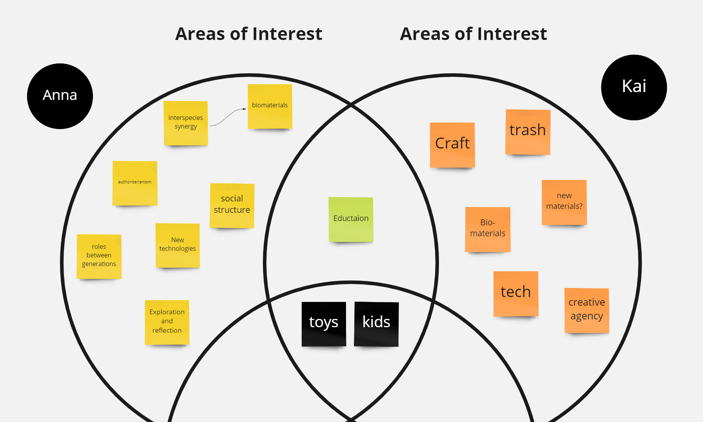
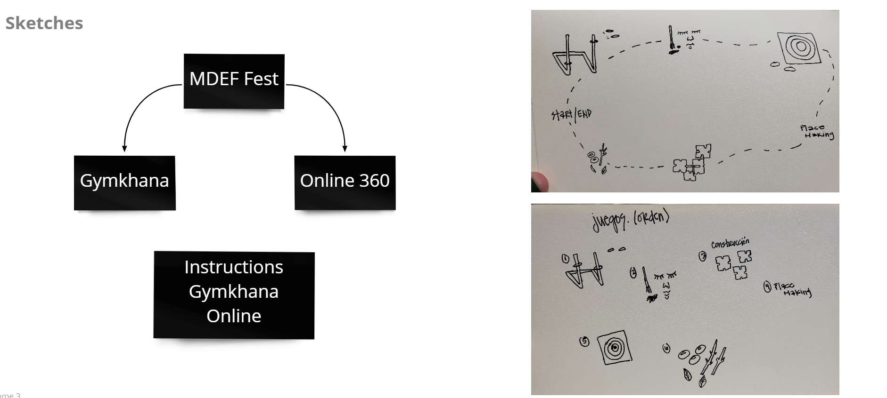
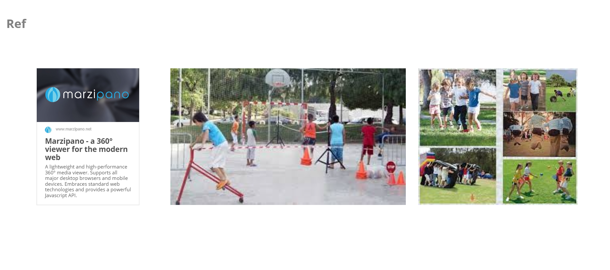
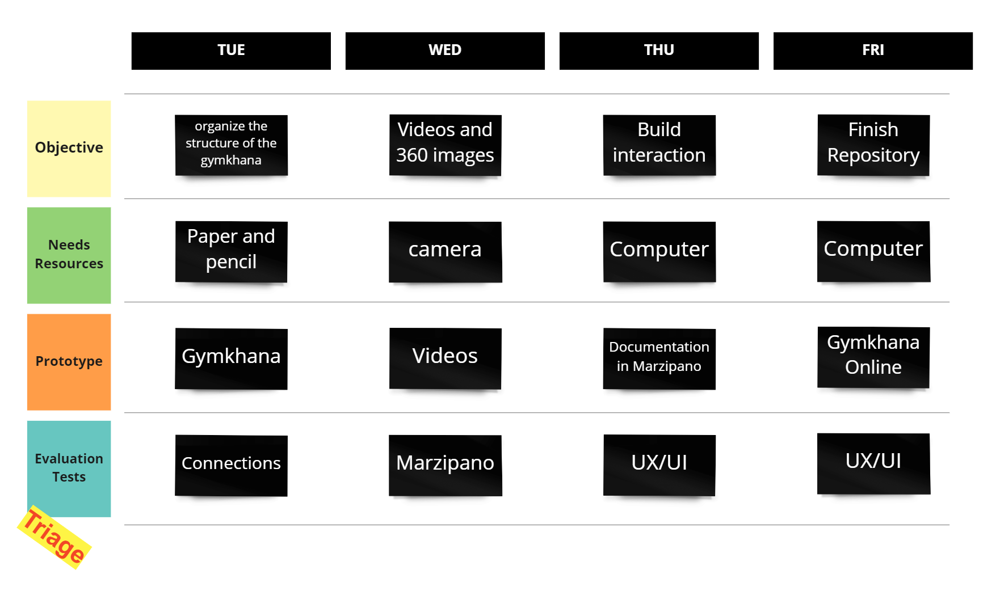
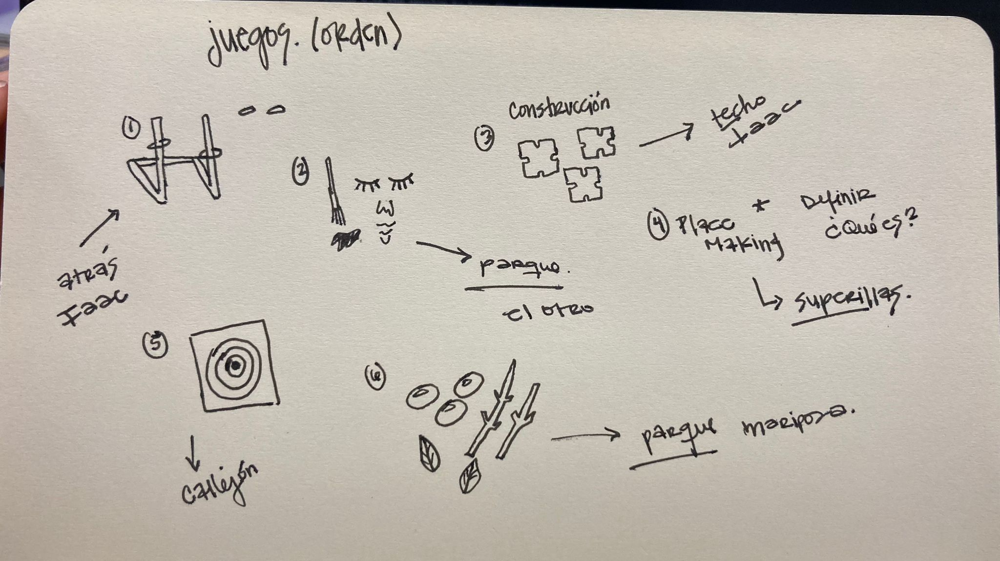

# FAB CHALLENGE IV

#### By [Kai Nieves](https://kais-site.webflow.io/fab-academy/fab-academy-weeks) & [Anna Mestres](https://anna-mestres.github.io/anna.mestres/fab/c4.html)

>Goal:
Recreate the route and information online of the Gymkhana for the MDEF Fest.

## Areas of Interest

## Initial Idea

For the MDEF we want to connect our projects (Anna, Borka & Kai) and show it in an interactive way, since we all work with children and games. So, we have decided to create a Gymkhana, apart from the other activities that will be done, with our toys.

Gymkhana: an equestrian day event comprising races and other competitions on horseback, typically for children.

The idea comes from wanting to connect other people who do not have the opportunity to see or participate in the gymkhana. As well as helping the people who will be present during the day of the activity to understand the instructions of each game, if we are not present or cannot explain it.

## Team Plan

# Process

### Steps

  1. [Materials and Digital Fabrication](https://github.com/Anna-Mestres/fab_challenge_IV#materials-and-digital-fabrication)
  2. [Brainstorming](https://github.com/Anna-Mestres/fab_challenge_I#brainstorming)
  3. [Test 1](https://github.com/Anna-Mestres/fab_challenge_I#test-1)
  4. [Drawings the Posters](https://github.com/Anna-Mestres/fab_challenge_I#drawing-the-posters)
  6. [Design Posters](https://github.com/Anna-Mestres/fab_challenge_I#design-posters)
  7. [Pictures 360](https://github.com/Anna-Mestres/fab_challenge_I#pictures-360)
  8. [First interaction website](https://github.com/Anna-Mestres/fab_challenge_I#first-interaction-website)
  9. [Test website](https://github.com/Anna-Mestres/fab_challenge_I#test-website)
  10. [Final Design](https://github.com/Anna-Mestres/fab_challenge_I#final-design)

## Materials and Digital Fabrication

In order to develop the online interaction we need the physical interaction first. And then we need to create the online circuit.

Physical Interaction
  * 6 Physical Games
  * Ply wood (600 x 300 x 0.5 mm)

Digital Interaction
  * Camera Insta360 One X (Josep has lent it to us)

The Digital Fabrication that we use are:

  * Laser cut (Trotec Speedy 400)
  * Rhino (Rhino 5 is the version to keep the files for make work the laser machine)
  * Illustrator (Inskcape it's open resource it could be used too)
  * Marzipano
  * Atom

## Brainstorming

We wanted to make a balanced circuit between the different types of play. We also wanted to think about where we could do the online interaction. Since the physical location has not been decided yet. So we have decided on a place for each game, which is related to its story and function.

The games we are going to present will be:

| Order | Game | Location | Author |
|-------|-----------------|-----------------------|---------------------|
| 1 | Anilla(s) | Bike Parking IAAC | George, Kai & Anna |
| 2 | Pintat | Butterfly Park | Kai |
| 3 | Modular Furniture | IAAC Roof | Anna |
| 4 | Crosshabit | SuperIlla | Borka |
| 5 | La Diana | Street | George, Kai & Anna |
| 6 | Forest Game | Park | Anna |

## Test 1
For test 1, Josep gave us a 360• camera that we had to test to see if it worked for the things that we were imagining. We test it at 

## Drawing the Posters

For the posters, Kai made some drawings in the ipad and after it they edited it in illsutrator. We decided to do this posters to use them as an indicator in the in-person Gymkhana for the MDEFest. The drawings are very childish so kids can understand it better and can play. 

## Design the Posters

We laser cut the drawings that we made on illustrator and cut them into 25cm x 25 cm piece of wood.

## Pictures 360•
We took 360• pictures of the games we are using for the Gymkhana.
See below:

The aniilas game: Is a throwing rings into the sticks of the toy.

Crosshabit: Imagining cities for all of us by building with construction parts.

Forest Game: A build up game with natural materials.

La Diana: Throwing stones to the target.

Modular Furniture: Building furniture game that you can stand on it.
